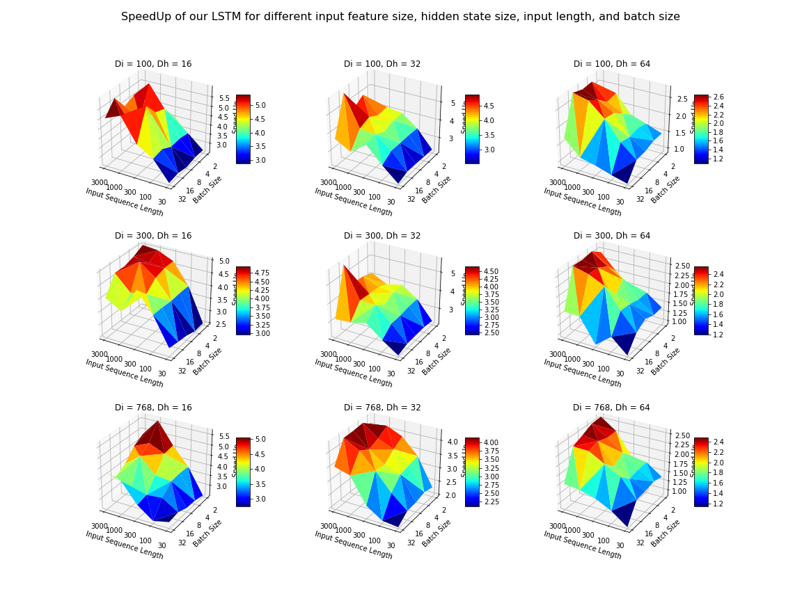

# FasterCudaRNN
## Context
Cudnn LSTM kernel leaves the GPU idle during recurring kernel launches and wastes computation resources.
## Work
Developed a faster LSTM CUDA kernel using batch-wise parallelism and gpu kernel fusion to hide recurring kernel launch
latency and using an efficient memory access pattern to minimize memory access latency.
## Impact
Achieved 4X speedup in inference speed compared to the state-of-the-art Cudnn LSTM kernel on GPU.
## Performance
speedup against cudnn LSTM, running on Nvidia GTX-1080)

## Author
Yixuan Geng, Chen Liang
